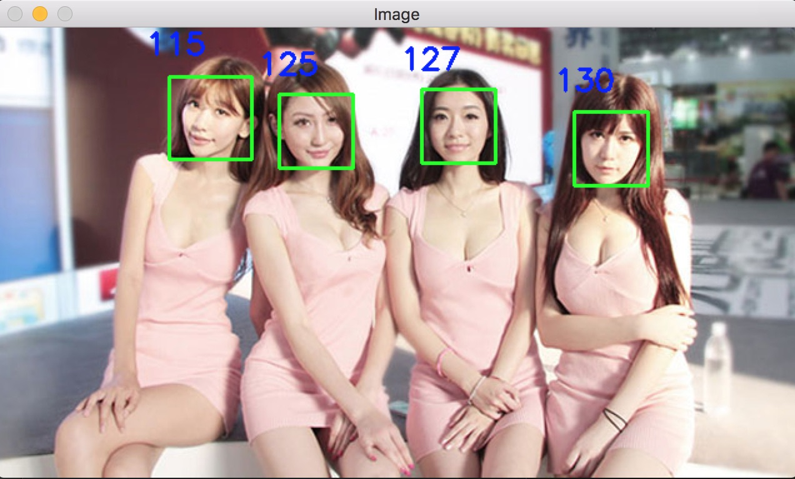
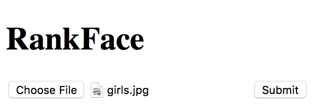

# Rank Face
A deep learning based model to judge the AQ, Appearance Quotient, of faces. (For Chinese Young Girls Only)</br>
Inspired by [Face Rank](https://github.com/Entropy-xcy/FaceRank)

## Inspiration
#### [Face Rank](https://github.com/Entropy-xcy/FaceRank)
My Repository is just a reversion of [Face Rank](https://github.com/Entropy-xcy/FaceRank). For more details check this fantastic repo.
#### [SCUT-FBP](http://www.hcii-lab.net/data/SCUT-FBP/EN/introduce.html)
This [Essay](http://www.hcii-lab.net/lianwen/Papers/[SMC%202015]SCUT-FBP-A%20Benchmark%20Dataset%20for%20Facial%20Beauty%20Perception.pdf) along with its dataset gave me great help in modeling and handling training issues.

## Installation

```shell
apt-get install python-dev python-pip -y
git clone https://github.com/Entropy-xcy/RankFace
cd ./RankFace
pip install -r requirements.txt
apt-get install python-opencv
# for macOS use 'brew install opencv'
# for Windows try the installation tutorial from opencv official website
wget http://entropy-xcy.bid/faceRank.h5
```

## Demo

```
python main.py girls.jpg
```
Here is the output


## Training
It is highly recommended to train the model yourself. Some accuracy issues may happen if the platform you have is different from the trainer's.
```
rm ./faceRank.h5
wget http://entropy-xcy.bid/dataset.zip
unzip dataset.zip
rm dataset.zip
# You may change parameters in the script.
python train.py
```

## Launch API Server
A basic webpage or POST API server build with keras
It may still work for mobile platforms

```
pip install werkzeug
pip install flask
# make sure that you already successfully launched the demo before the next step
# The default port is 5000, you may change it as you wish in the code
python API_server.py
```

## Model Summary:
```
_________________________________________________________________
Layer (type)                 Output Shape              Param #   
=================================================================
conv2d_1 (Conv2D)            (None, 128, 128, 32)      896       
_________________________________________________________________
activation_1 (Activation)    (None, 128, 128, 32)      0         
_________________________________________________________________
conv2d_2 (Conv2D)            (None, 126, 126, 32)      9248      
_________________________________________________________________
activation_2 (Activation)    (None, 126, 126, 32)      0         
_________________________________________________________________
max_pooling2d_1 (MaxPooling2 (None, 63, 63, 32)        0         
_________________________________________________________________
dropout_1 (Dropout)          (None, 63, 63, 32)        0         
_________________________________________________________________
flatten_1 (Flatten)          (None, 127008)            0         
_________________________________________________________________
dense_1 (Dense)              (None, 128)               16257152  
_________________________________________________________________
activation_3 (Activation)    (None, 128)               0         
_________________________________________________________________
dropout_2 (Dropout)          (None, 128)               0         
_________________________________________________________________
dense_2 (Dense)              (None, 1)                 129       
=================================================================
Total params: 16,267,425
Trainable params: 16,267,425
Non-trainable params: 0
_________________________________________________________________
```
